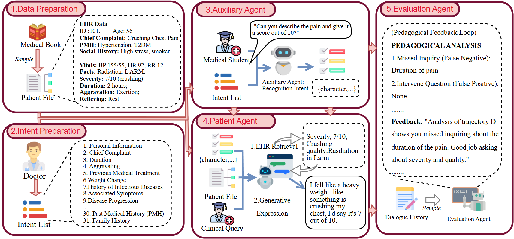

# 🏥 EasyMED


<p align="center">


</p>

**EasyMED** is a research-oriented **multi-agent virtual standardized patient (VSP) framework** for medical education.  
It decomposes clinical interaction into coordinated modules for **intent recognition**, **patient simulation**, and **educational evaluation**, enabling more controllable multi-turn dialogue, structured information disclosure, and pedagogically meaningful feedback.

This repository accompanies the paper:

> **Human or LLM as Standardized Patients? A Comparative Study in Medical Education**

---


## Overview

Standardized patients (SPs) are essential for training medical students in history taking, communication, and clinical reasoning. However, conventional human-SP training is often expensive, labor-intensive, and difficult to scale. EasyMED is proposed as a controllable and reusable virtual standardized patient framework that supports clinical skills training through structured multi-turn interaction.

Unlike end-to-end dialogue simulators, EasyMED explicitly separates the system into coordinated functional agents. This modular design improves interaction stability, supports intent-aware response generation, and facilitates structured post-hoc educational assessment.

EasyMED is designed for:

- medical history-taking practice
- virtual standardized patient simulation
- educational evaluation of clinical dialogue
- reproducible research on medical dialogue agents

---

## Highlights

- **Multi-agent architecture** for controllable virtual standardized patient simulation  
- **Intent-aware interaction** for fine-grained information disclosure  
- **Case-grounded response generation** based on structured patient records  
- **Trajectory-level educational evaluation** for consultation quality analysis  
- **SPBench integration** for research benchmarking and reproducible evaluation  
- Compatible with **OpenAI-style APIs**, including OpenAI, Azure OpenAI, and local compatible backends

---

## Framework Architecture

<p align="center">
  
</p>

<p align="center">
  <em>Figure 1. Overview of the EasyMED framework. The system separates intent recognition, patient simulation, and educational evaluation into coordinated agents for controllable virtual standardized patient interaction.</em>
</p>

---

## Main Components

EasyMED consists of three major modules.

### 1. Patient Agent
The Patient Agent simulates a virtual patient in multi-turn doctor–patient interaction.  
It generates responses grounded in the structured case record while preserving realism and avoiding unnecessary leakage of case information.

### 2. Intent Recognition Agent
The Intent Recognition Agent identifies the clinical intent behind each learner question.  
This module helps the system determine which part of the patient record should be disclosed and supports more faithful and controlled patient simulation.

### 3. Evaluation Agent
The Evaluation Agent reviews the full consultation trajectory after the interaction ends.  
It compares the student’s questioning process, collected information, and submitted decisions against case-specific reference items to generate structured educational feedback.

---

## SPBench

This repository also includes **SPBench**, a benchmark for evaluating virtual standardized patient systems.

SPBench is designed to assess the quality of simulated patient interaction from an educational perspective. Rather than focusing only on static question answering, it evaluates **interaction-level patient behavior** in multi-turn consultation settings.

The benchmark supports the evaluation of generated dialogue quality along multiple expert-defined dimensions, including:

- query comprehension
- case consistency
- controlled disclosure
- response completeness
- logical coherence
- language naturalness
- conversational consistency
- patient demeanor

SPBench can be used to compare EasyMED with other virtual patient or LLM-based simulation baselines.

---

## Repository Structure

```text
EasyMED/
├── consultation.py                    # VirtualPatient implementation
├── intent_recognition.py              # IntentRecognizer implementation
├── evaluation.py                      # ClinicalEvaluator implementation
└── requirements.txt

SPBench/
├── create_conversation.py             # Generate dialogues with VirtualPatient
├── create_conversation_with_intent.py # Generate dialogues with turn-level intent labels
├── evaluate_sp.py                     # Evaluate dialogue quality on SPBench
├── SPBench_case/                      # Patient case JSON files
└── SPBench_taking/                    # Benchmark question lists

.env.example                           # Example environment variable configuration
README.md

---
```

## Quick start

### 1 · Clone the repository

```bash
git clone https://github.com/FreedomIntelligence/EasyMED.git
cd EasyMED
```

### 2 · Install dependencies

```bash
pip install -r EasyMED/requirements.txt
```

### 3 · Set your API key

```bash
# Copy and edit the example file
cp .env.example .env

# Or export directly in your shell
export EASYMED_API_KEY=sk-...
export EASYMED_BASE_URL=https://api.openai.com/v1   # optional
export EASYMED_MODEL=gpt-4o                         # optional
```

EasyMED works with **any OpenAI-compatible API** (OpenAI, Azure OpenAI, local vLLM, etc.).

---

## EasyMED modules

### VirtualPatient — `EasyMED/consultation.py`

```python
from EasyMED.consultation import VirtualPatient
import json

patient = VirtualPatient()        # reads EASYMED_* env vars

with open("SPBench/SPBench_case/01.json", encoding="utf-8") as f:
    case_data = json.load(f)

history = []
while True:
    question = input("Doctor: ")
    answer   = patient.chat(case_data, question, history)
    print(f"Patient: {answer}\n")
    history.append({"question": question, "answer": answer})
```

### IntentRecognizer — `EasyMED/intent_recognition.py`

```python
from EasyMED.intent_recognition import IntentRecognizer

recognizer = IntentRecognizer()

intent = recognizer.recognize(
    question="How is your sleep lately?",
    history=[{"question": "Where does it hurt?", "answer": "My head hurts."}],
)
print(intent)   # e.g. "General Condition"
```

**32 intent categories:**

> Personal Information · Chief Complaint · Onset Time · Triggering Factors ·
> Symptom Location · Symptom Characteristics · Duration and Frequency ·
> Aggravating / Relieving Factors · Associated Symptoms · Disease Progression ·
> Prior Diagnosis and Treatment · General Condition · Bowel and Bladder Function ·
> Weight Change · Chronic Disease History · Infectious Disease History ·
> Surgical and Trauma History · Transfusion History · Allergy History ·
> Vaccination History · Medication History · Travel History · Lifestyle Habits ·
> Occupational History · Sexual History · Marital and Reproductive History ·
> Family History · Menstrual History · Patient Understanding ·
> Patient Concerns · Patient Expectations · Small Talk

### ClinicalEvaluator — `EasyMED/evaluation.py`

```python
from EasyMED.evaluation import ClinicalEvaluator
import json

evaluator = ClinicalEvaluator()

with open("case_template.json", encoding="utf-8") as f:
    template = json.load(f)

session_data = {
    "sessionId": "student01_case01_1711900000",
    "userId":    "student01",
    "caseId":    "01",
    "history": [
        {
            "question": "Where does it hurt?",
            "answer":   "My lower right abdomen.",
            "intentClassification": "Symptom Location"
        },
        ...
    ],
    "performedExams": [
        {
            "itemName": "Abdominal palpation",
            "result":   "Tenderness at McBurney's point, rebound tenderness positive",
            "examType": "physical_exam"
        },
    ],
    "userSubmissions": [
        {"data": {
            "mainDiagnoses": [{"diagnosisName": "Acute appendicitis"}],
            "differentialDiagnoses": [
                {"disease": "Right-sided salpingitis", "status": "exclude"}
            ],
        }}
    ],
    "userTreatments": [
        {"data": {"treatmentPlan": "1. Emergency appendectomy\n2. Anti-infective therapy"}},
    ],
}

result = evaluator.evaluate(session_data, template)
for section, text in result.items():
    print(f"=== {section} ===")
    print(text)
```

---

## SPBench

See **[SPBench/README.md](SPBench/README.md)** for the complete guide on:

- SPBench case data format
- Generating dialogues with `create_conversation.py`
- Adding intent labels with `create_conversation_with_intent.py`
- Evaluating dialogue quality with `evaluate_sp.py`

---

## Case data format

Each case file (`SPBench_case/<id>.json`) follows this structure:

```json
{
  "caseId":          "01",
  "caseTitle":       "Acute Appendicitis",
  "caseDescription": "28-year-old male presenting with right lower quadrant pain.",
  "patientProfile": {
    "name":                      "John Smith",
    "age_value":                 28,
    "age_unit":                  "years old",
    "gender":                    "Male",
    "occupation":                "Teacher",
    "chief_complaint":           "Right lower abdominal pain for 6 hours",
    "present_illness_history":   "...",
    "past_medical_history":      "None",
    "personal_history":          "Non-smoker, non-drinker",
    "family_history":            "No family history of similar condition",
    "other_medical_history":     "None",
    "surgery_injury_history":    "None",
    "transfusion_history":       "None",
    "infection_history":         "None",
    "allergy_history":           "None",
    "menstrual_history":         "N/A",
    "reproductive_history":      "N/A"
  },
  "mustConsultionItems":    ["Chief Complaint", "Onset Time", "Triggering Factors", "Associated Symptoms"],
  "optionalConsultionItems":["General Condition", "Family History"],
  "mustPhysicalExams":      ["Temperature", "Blood Pressure", "Abdominal palpation"],
  "optionalPhysicalExams":  ["Rectal examination"],
  "mustAuxiliaryLabs":      ["CBC", "Abdominal ultrasound"],
  "optionalAuxiliaryLabs":  ["Abdominal CT"],
  "physicalExams":          {
    "Temperature": "38.2°C",
    "Abdominal palpation": "McBurney's point tenderness (+), rebound tenderness (+)"
  },
  "auxiliaryLabs":          {
    "CBC": "WBC 12.3×10⁹/L",
    "Abdominal ultrasound": "Swollen appendix, diameter 8 mm"
  },
  "diagnoses": {
    "mainDiagnosis": {"disease": "Acute appendicitis"},
    "differentialDiagnoses": [
      {"disease": "Right-sided salpingitis"},
      {"disease": "Right ureteral stone"}
    ]
  },
  "treatments": "1. Emergency appendectomy\n2. Pre-operative anti-infective therapy (ceftriaxone 2 g IV)\n3. Fluid resuscitation"
}
```

---

## Environment variables

| Variable | Required | Default | Description |
|----------|----------|---------|-------------|
| `EASYMED_API_KEY` | ✅ | — | OpenAI-compatible API key |
| `EASYMED_BASE_URL` | ❌ | OpenAI default | Custom API endpoint |
| `EASYMED_MODEL` | ❌ | `gpt-4o` | Model name |

---

# Citation

If you use EasyMED in your research, please cite:

```bibtex
@article{zhang2025human,
  title={Human or LLM as Standardized Patients? A Comparative Study for Medical Education},
  author={Zhang, Bingquan and Liu, Xiaoxiao and Wang, Yuchi and Zhou, Lei and Xie, Qianqian and Wang, Benyou},
  journal={arXiv preprint arXiv:2511.14783},
  year={2025}
}
```

---

# License

This project is released under the **MIT License**.

---

# Acknowledgements

We thank the clinical experts, standardized patient instructors, medical students, and collaborators who contributed to the construction and evaluation of this project.

---

# Contact

For questions or collaborations, please open an issue on GitHub.
